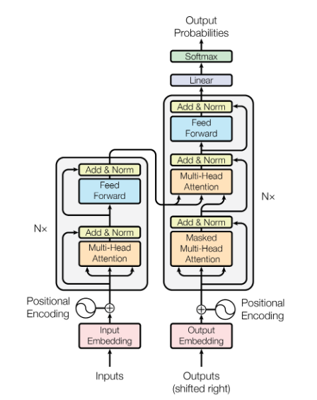
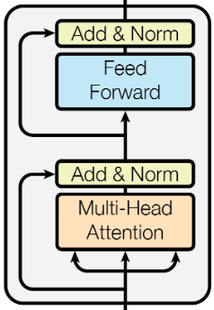
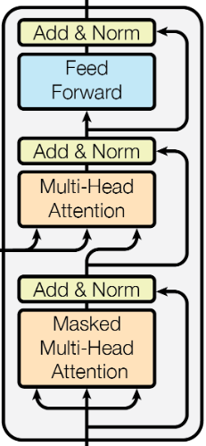
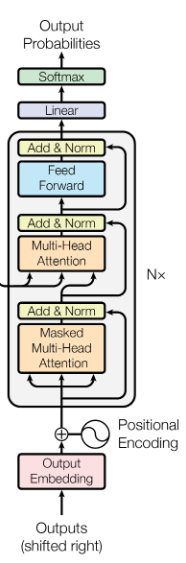
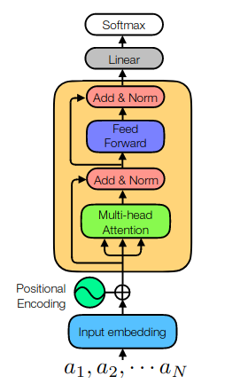

# Introduction to Transformers

Ejaaz Merali

PIQuIL

August 7th, 2020

---

## Transformers

- Popular seq2seq or autoregressive-generative model architecture
- Key component is the *attention* mechanism which seems to be the main reason for this model's success

- The seq2seq Transformer consists of an encoder and a decoder

- In this part of the talk, we'll focus on how the Transformer works

<!--
_footer: (Vaswani et al. 2017)
-->

---

## Outline

- Encoder
  - Attention
  - Multi-head Attention (MHA)

- Decoder
  - Masked MHA

- Generative Transformer

- Pre/post-processing
  - Embedding Layers
  - Positional Encoding

---

## Encoder

<!--
_paginate: false
_footer: (Vaswani et al. 2017)
-->

- Encoding layers are not autoregressive
  - can process the entire input sequence at once
- Call the input to the layer $X \in \mathbb{R}^{b\times n\times d_m}$
- $b$ is the batch length, $n$ is the sequence length, $d_m$ is the embedding size

---

## Attention (1/3)

Define (using Einstein summation):
$$
Q_{btk} = W^{(Q)}_{mk} X_{btm}\quad
K_{btk} = W^{(K)}_{mk} X_{btm}\quad
V_{btv} = W^{(V)}_{mv} X_{btm}
$$

Where:

$$
W^{(Q)}, W^{(K)} \in \mathbb{R}^{d_m \times d_k}\quad
W^{(V)} \in \mathbb{R}^{d_m \times d_v}
$$

$Q, K$, and $V$ are called the *queries, keys, and values*, respectively. They are then passed to the attention function:

$$\text{Attention}(Q, K, V) = \text{softmax}\left(\frac{QK^T}{\sqrt{d_k}}\right) V$$

which operates on each element in the batch independently

---

## Attention (2/3)

<!--
_footer: 1. See, for example: Yang et al. 2019 (arXiv:1910.10202)
-->

Let's break it down a bit more:

$$(QK^T)_{btt'} = \sum_{k=1}^{d_k} Q_{btk} K_{bt'k} \in \mathbb{R}^{b\times n \times n}$$

We first "normalize" the contraction over $k$ by dividing this quantity by $\sqrt{d_k}$, since $d_k$ is the number of elements in the summation. Call this quantity $E_{btt'}$.

Next, we normalize the $t'$ index to sum to $1$ using the softmax function (note that other normalization functions have been used$^1$)

$$
P_{btt'} = \text{softmax}_{t'}(E_{btt'})
= \frac{\exp(E_{btt'})}{\sum_{t''} \exp(E_{btt''})}
$$

where $P_b$ is sometimes called the *context mapping matrix*.

---

## Attention (3/3)

The attention matrices are then computed as:
$$
\lbrack \text{Attention}(Q, K, V)\rbrack_{btv}
= P_{btt'}V_{bt'v} \in \mathbb{R}^{b\times n\times d_v}
$$

---

## Multi-head Attention

The idea is to perform Attention $h$ times with different learned parameters and then aggregate the result of each "attention-head" with a learned linear map.

$$
A^{(i)}_{btv}
= \lbrack \text{Attention}(XW^{(Q,i)}, XW^{(K,i)}, XW^{(V,i)}) \rbrack_{btv}
= \lbrack \text{Attention}(Q^{(i)}, K^{(i)}, V^{(i)}) \rbrack_{btv}
$$

We then concatenate all $A^{(i)}$'s together along the index $v$, before passing the result to a linear map:

$$A_{btv'} = \text{Concat}_v(A^{(1)}_{btv}, A^{(2)}_{btv}, \ldots, A^{(h)}_{btv})$$

then,

$$\lbrack\text{MHA}(X)\rbrack_{btm} = A_{btv} W^{(O)}_{vm}$$

where $W^{(O)} \in \mathbb{R}^{hd_v \times d_m}$, $MHA: \mathbb{R}^{n\times d_m} \rightarrow \mathbb{R}^{n\times d_m}$ (the batch-index is ignored by MHA)

---

## Add & Norm

<!--
_paginate: false
_footer: (Vaswani et al. 2017)
-->

The last step of the attention sublayer is a residual connection, followed by a $\text{LayerNorm}$:

$$\text{LN}(X + \text{MHA}(X))$$

$\text{LayerNorm}$ is the only layer that operates on the batch index:

$$
\text{LN}(X_{b}) = \gamma\odot\left(\frac{X_{b}\; \ldotp\!- \;\mathbb{E}_b\lbrack X_{b}\rbrack}{\sqrt{\text{Var}_b(X_{b})+\epsilon}}\right)
\;\ldotp\!+\; \beta
$$

where $\gamma, \beta \in \mathbb{R}^{n\times d_m}$ are learnable parameters.

---

## Feed-Forward

This step is fairly simple, we build a Feed-Forward Neural Net with a single hidden layer, that is applied on the feature index of the input array.

That is, it ignores the batch and time indices.

$$\text{FFN}(x) = \max(0, xW_1 + b_1)W_2 + b_2$$

where $W_1, W_2^T \in \mathbb{R}^{d_m \times d_f}$, and we typically take $d_f > d_m$.

Afterwards, we do the same residual connection followed by a $\text{LayerNorm}$ step that we did previously.

---

## Encoder (summary)

<!--
_paginate: false
_footer: (Vaswani et al. 2017)
-->

Thus, the encoder is a function
$$T_e : \mathbb{R}^{b\times n \times d_m} \to \mathbb{R}^{b\times n \times d_m}$$

As is typical for Deep Learning, we compose this mapping with itself a few times. In the original paper, they used $N=6$ encoding layers.

---

## Decoder (1/4)

<!--
_paginate: false
_footer: (Vaswani et al. 2017)
-->

Compared to the encoder, there are 2 MHA steps for the decoder.

The first MHA step is modified to prevent data-flow from the future back into the past. That is, the decoder is constrained to be an autoregressive generator. This is done by introducing a masking step to the attention function:

The input to the softmax is modified as such:

$$
E'_{btt'} =
\begin{cases}
E_{btt'} & \text{if } t' \leq t \\
-\infty & \text{otherwise}
\end{cases}
$$

---

## Decoder (2/4)

The second MHA step in the decoder is modified to compute its $Q$ from the output of the previous MHA, while its $K, V$ are computed from the output of the encoder stack.

Note that this means for a specific input sequence, $K, V$ will be constant throughout the generation of the output sequence, and will contain information on the entire input sequence, not just the first part.

---

## Decoder (3/4)

The decoder is thus a function:

$$
T_d : \mathbb{R}^{b\times n \times d_m} \times \mathbb{R}^{b\times m \times d_m} \to \mathbb{R}^{b\times m \times d_m}
$$

The first argument is the encoded representation of the entire input sequence, and the second contains the outputs generated so far.

Again, $T_d$ is often layered/composed with itself. Note that this layering/composition only occurs in the second argument.

Original paper used $N=6$ decoder layers as well.

---

## Decoder (4/4)

<!--
_paginate: false
_footer: (Vaswani et al. 2017)
-->

Finally, the output of the decoder stack is passed through a (bias-free, rectangular) linear layer, followed by a softmax normalization, both of which act only on the feature dimension of the data (i.e. ignoring batch and time indices).

Generating a sequence then proceeds as follows:

1. Input an array to the decoder
2. Decoder will fill it with probabilities
3. Sample timestep $t$, updating that part of the input array accordingly
4. Go back to step 1 and do the next timestep with the updated input

---

## Generative Transformer

<!--
_paginate: false
_footer: (Carrasquilla et al. 2019)
-->

Exactly the same as a decoder, with the second MHA sublayer removed.

---

## Pre/post-processing

A few extra things need to be done before the Transformer's inputs and outputs can be dealt with.

The first is *Embedding* the vocabulary vectors into a smaller, but denser representation.

The second is adding a *Positional Embedding* that informs both the encoder and decoder of the relative positions of each token in the sequence.

---

## Embedding Layer (1/2)

Words/tokens in the vocabulary are typically one-hotted so they can be processed by a neural net. This isn't the most optimal representation however, as 1-hot vectors are extremely sparse and also very large.

If we have a vocabulary size of 10 thousand words, our 1-hot vectors will all be 10 thousand elements long. Then recall that no layer of the Transformer ever outputs a smaller vector than it got as input.

We create an *Embedding Layer* which is just a linear layer that with a rectangular weight matrix, $W^{(E)} \in \mathbb{R}^{v\times d^m}$ where $v$ is the vocabulary size, and $d_m \ll v$.

---

## Embedding Layer (2/2)

<!--
_paginate: false
_footer: See Press & Wolf, 2016 (arXiv:1608.05859)
-->

Then to map back into the vocabulary space from the embedding space, we need another Embedding layer with the sizes of the weight matrix reversed. This is what the final linear layer after the decoder stack does.

It's often a good idea to tie the weights of your input embedding to those of your output embedding$^1$: $W^{(I,E)} = (W^{(O,E)})^T$

In addition, the inventors of the Transformer tied the input embeddings of both the encoder and decoder stacks together.

---

## Positional Encoding (1/2)

Positional Encoding is intended to help the model understand the relative positions of tokens in a sequence.

It is typically implemented as an additive bias term to the output of the embedding layer.

A common positional encoding is the fixed sinusoidal encoding:

$$\text{PE}_{(pos, 2i)} = \sin(pos/10000^{(2i/d_m)})$$
$$\text{PE}_{(pos, 2i+1)} = \cos(pos/10000^{(2i/d_m)})$$

---

## Positional Encoding (2/2)

Learned positional encodings also exist, but they seem to perform similarly to the fixed encoding.

There are newer Positional Encoding methods however, that seem interesting:

Complex Positional Embeddings: Wang et al. 2020 (arXiv:1912.12333)

TUPE: Ke et al. 2020 (arXiv:2006.15595)

---

## Regularization

The authors of the Transformer paper suggest we apply residual dropout to the Add & Norm steps during training.

What this means is that dropout is applied to the output of each sublayer before it is added to its input:

$$\text{LN}(X + \text{Dropout}_p(\text{SubLayer}(X)))$$

where we typically set $p=0.1$

They also apply dropout after adding the positional encoding to the input embeddings of both encoder and decoder stacks.

---

## References (1/2)

Carrasquilla, Juan, et al. "Probabilistic Simulation of Quantum Circuits with the Transformer." Bulletin of the American Physical Society 65 (2020).

Press, Ofir, and Lior Wolf. "Using the Output Embedding to Improve Language Models." Proceedings of the 15th Conference of the European Chapter of the Association for Computational Linguistics: Volume 2, Short Papers. 2017.

Vaswani, Ashish, et al. "Attention is all you need." Advances in neural information processing systems. 2017.

---

## References (2/2)

Ke, Guolin, Di He, and Tie-Yan Liu. "Rethinking the Positional Encoding in Language Pre-training." arXiv preprint arXiv:2006.15595 (2020).

Wang, Benyou, et al. "Encoding word order in complex embeddings." International Conference on Learning Representations. 2019.

Yang, Muqiao, et al. "Complex Transformer: A Framework for Modeling Complex-Valued Sequence." ICASSP 2020-2020 IEEE International Conference on Acoustics, Speech and Signal Processing (ICASSP). IEEE, 2020.
