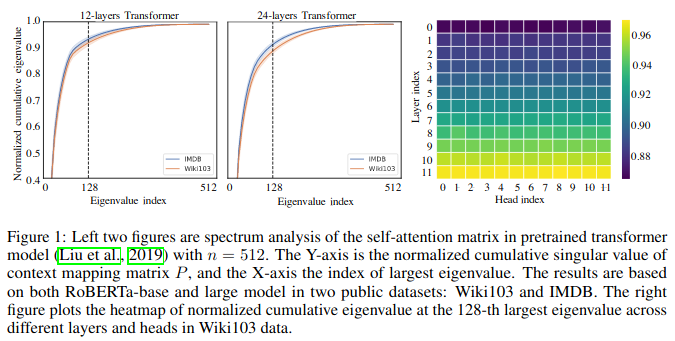
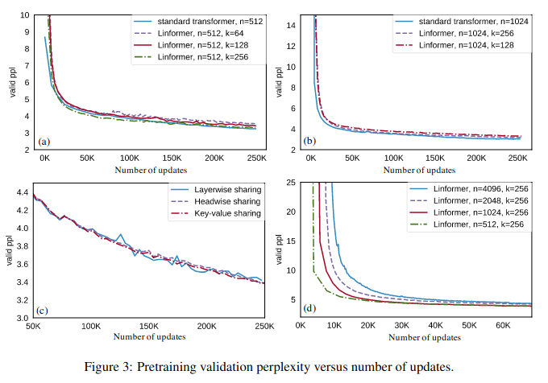
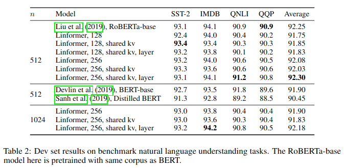
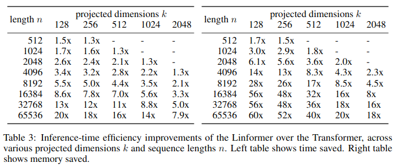
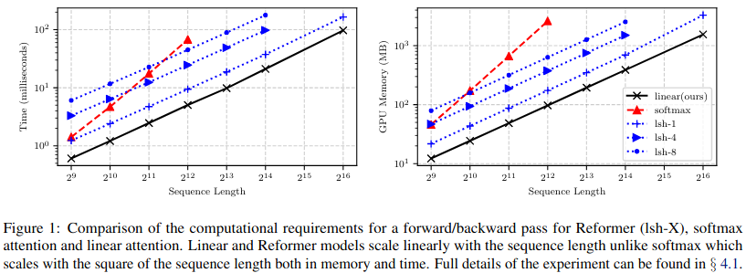
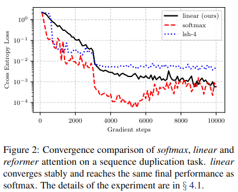
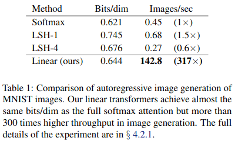
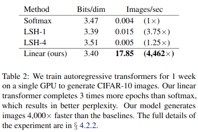
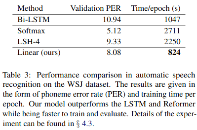

# Linearizing Transformers

Ejaaz Merali

PIQuIL

August 7th, 2020

---

## The Trouble with Transformers

$$\text{Attention}(Q, K, V) = \text{softmax}\left(\frac{QK^T}{\sqrt{d_k}}\right) V$$

Computation of the attention function has horrible time and memory complexity.
In terms of the sequence length $n$ it is $O(n^2)$. This gets costly as $n$ gets very large, as it typically does in natural language processing (and sometimes in physics).

In this talk, we'll discuss modifications to the attention function that seek to reduce its time and memory complexity.

---

## Outline

- Linformer
  - Self-Attention is Low Rank
  - Projecting Keys and Values into a lower-dimensional space
  - Additional Efficiency Improvements
  - Results
- Transformers are RNNs
  - Generalizing Attention
  - Linearizing Attention
  - How to implement Causal Masking
  - Expressing Transformers as RNNs
  - Results
- Can we combine the two methods?

---

## Linformer

Recent paper by Wang et al. (2020) that reduces the time complexity of attention by making use of the fact that the *context mapping matrix*, $P$, is low rank.

$$P = \text{softmax}\left( \frac{QK^T}{\sqrt{d_k}} \right)$$

On the next slide, we show plots of the cumulative distribution of the singular values of $P$, averaged over 10 thousand sentences.

---

<!--
_class: default
_footer: (Wang et al. 2020)
-->

---

## Self-Attention is Low Rank

**Theorem 1**: For any $Q, K \in \mathbb{R}^{n \times d_k}$, and $V \in \mathbb{R}^{n \times d_v}$, for any column vector $v$ of $V$, there exists a low-rank matrix $\tilde{P} \in \mathbb{R}^{n\times n}$ such that:

$$
\text{Pr}(\| \tilde{P}v - Pv \| \lt \epsilon \|Pv\|) > 1 - o(1)
\quad
\text{and}
\quad
\text{rank}(\tilde{P}) = \Theta(\log(n))
$$

which means that, for any $\epsilon$ we can construct a matrix $\tilde{P}$ (which has rank on the order of $\log(n)$) that has a high probability of approximating the action of $P$ on a vector $v$.

This low-rank approximation to $P$ constructed in the proof takes the form:

$$
\tilde{P} = P R^T R
$$
where $R \in\mathbb{R}^{k\times n}$ ($k < n$), with entries drawn from the normal distribution $N(0, 1/k)$.

---

## Projecting Keys and Values to a Lower Dimensional space

Let $E, F\in \mathbb{R}^{k\times n}$. We'll use these matrices to project our keys and values into a lower dimensional space. Thus, our single-head attention becomes:

$$\text{Attention}(Q, EK, FV) = \text{softmax}\left(\frac{Q(EK)^T}{\sqrt{d_k}}\right) (FV)$$

Now our context mapping matrix $P$ has shape $n \times k$ (with $k\ll n$), and the values matrix is effectively of size $k \times d_v$. We see that the operations above take time/space $O(nk) < O(n^2)$.

In a Multi-head Attention setting, we'd typically have separately trained $E, F$ matrices for each attention head.

---

## Additional Efficiency Improvements

The authors propose a few more tweaks to further optimize parameter count, performance, and efficiency.

1. **Headwise sharing**: share $E, F$ across all heads in a MHA layer
2. **Key-value sharing**: Headwise sharing + using a single projection matrix instead of two $E = F$
3. **Layerwise sharing**: Key-value sharing + use the same projection matrix in *every* MHA layer

---

## Results

---

<!--
_class: default
_footer: (Wang et al. 2020)
-->

---

<!--
_class: default
_footer: (Wang et al. 2020)
-->

---

<!--
_class: default
_footer: (Wang et al. 2020)
-->

---

## Transformers are RNNs

By using a generalization of the attention function, Katharopoulos et al. (2020) were able to construct an alternative to softmax-attention which allows the computation to be done in linear time and space.

$$\text{Attention}(Q, K, V) = \text{softmax}\left(\frac{QK^T}{\sqrt{d_k}}\right) V$$

---

## Generalizing Attention

The main idea is to view the softmax function as taking a "similarity score" between the queries and keys.

$$A(Q, K, V) = \frac{\sum_j \text{sim}(Q_i, K_j) V_j }{\sum_j \text{sim}(Q_i, K_j)}$$

where $Q_i$ is the $i$th row of the matrix $Q$. We recover the softmax-attention by setting $\text{sim}(q, k) = \exp(q^T k / \sqrt(d_k))$

---

## Linearizing Attention

The only necessary constraint on the similarity function is that the output be non-negative. This includes all kernel functions:
$$k(x, y) : \mathbb{R}^{F} \times \mathbb{R}^{F} \to \mathbb{R}^+$$

So, we take a kernel with feature representation $\phi(x)$:

$$
\lbrack A(Q, K, V)\rbrack_i = \frac{\sum_j^n \phi(Q_i)^T \phi(K_j) V_j^T }{\sum_j^n \phi(Q_i)^T \phi(K_j)}
\stackrel{(*)}{=} \frac{\phi(Q_i)^T \sum_j^n \phi(K_j) V_j^T }{\phi(Q_i)^T \sum_j^n \phi(K_j)}
$$

Due to the factorization in step $(*)$, we can cache the values of the sums over $j$ and use them with multiple queries. As a result, we have linear time and space complexity in the sequence length $n$.

---

## Short discussion on Complexity

The number of FLOPs for softmax attention scales as $O(n^2 \max(d_k, d_v))$, while the linearized attention we just derived scales as $O(nc d_v)$ where $c$ is the output dimension of the feature map $\phi$.

In the paper, they chose to use an elementwise feature map (thus giving $O(n d_k d_v)$ scaling):
$$\phi : \mathbb{R} \to \mathbb{R}^+$$
$$\phi(x) = \text{elu}(x) + 1$$

where $\text{elu}$ is the exponential linear unit (sort-of a smoothed $\text{ReLU}$)
$$\text{elu}(x) = \begin{cases}
    x & \text{if } x > 0 \\
    \exp(x) - 1 & \text{if } x \leq 0
\end{cases}$$

---

## How to Implement Causal Masking (1/2)

Recall that, in order to preserve the autoregressive sampling of a generative Transformer or a decoder layer, we needed to apply masking to the first attention layer.

Instead of setting parts of the input of the similarity function to a masking value as before, we simply truncate the summation in the matrix multiplication between the context mapping matrix and the values matrix.

$$\lbrack A(Q, K, V)\rbrack_i = \frac{\phi(Q_i)^T \sum_j^i \phi(K_j) V_j^T }{\phi(Q_i)^T \sum_j^i \phi(K_j)}$$

Define: $S_i = \sum_j^i \phi(K_j) V_j^T \in \mathbb{R}^{d_k \times d_v}$ and $Z_i = \sum_j^i \phi(K_j) \in \mathbb{R}^{d_k}$

---

## How to Implement Causal Masking (2/2)

Then we have:

$$\lbrack A(Q, K, V)\rbrack_i = \frac{\phi(Q_i)^T S_i }{\phi(Q_i)^T Z_i}$$

We note that we can compute $S_i$ and $Z_i$ from $S_{i-1}$ and $Z_{i-1}$ in constant time (wrt the sequence length $n$). Causal masking didn't break the linear scaling.

*Problem*: a naive use of automatic differentiation for this masked attention function will require storing all intermediate values of $S_i$ to compute the gradients. This would break the linear space scaling.

The authors derived the relevant gradients which allow performing the backward pass of causal linear attention in linear time and constant memory.

---

## Expressing Transformers as RNNs

Notice that at each timestep, we are updating $S$ and $Z$ in order to produce our output.

This looks like an RNN with two hidden states.

$$
\begin{cases}
s_0, z_0 = 0, 0 \\
s_t = s_{t-1} + \phi(x_t W^{(K)}) (x_t W^{(V)})^T \\
z_t = z_{t-1} + \phi(x_t W^{(K)}) \\
a_t = \frac{\phi(x_t W^{(Q)})^T s_t}{\phi(x_t W^{(Q)})^T z_t} \\
y_t = f_l\left(a_t + x_t\right)
\end{cases}
$$

where $f_l$ is the Feed-Forward Net at the end of the Transformer layer $l$, and $x_t$ is the input to the Transformer layer.

---

## Multi-head Linear Attention as an RNN (not in the paper)

We easily see that a Multi-head Attention analogue of the linear Transformer would function as an RNN with $2h$ hidden states:

$$
\begin{cases}
s^i_0, z^i_0 = 0, 0 \\
s^i_t = s^i_{t-1} + \phi(x_t W^{(K,i)}) (x_t W^{(V,i)})^T \\
z^i_t = z^i_{t-1} + \phi(x_t W^{(K,i)}) \\
a^i_t = \frac{\phi(x_t W^{(Q,i)})^T s^i_t}{\phi(x_t W^{(Q,i)})^T z^i_t} \\
a_t = \text{Concat}(a^1_t, a^2_t, \ldots, a^h_t)W^{(0)} \\
y_t = f_l\left(a_t + x_t\right)
\end{cases}
$$

---

## Transformers are RNNs: Results

---

<!--
_class: default
_footer: (Katharopoulos et al. 2020)
-->

---

<!--
_class: default
_footer: (Katharopoulos et al. 2020)
-->

---
<!--
_class: default
_footer: (Katharopoulos et al. 2020)
-->

---
<!--
_class: default
_footer: (Katharopoulos et al. 2020)
-->

---

## Can we combine the two methods?

Notice that in general, the feature map $\phi(x)$ can output a vector of a different size than its input.

Applying $E$ to the output of applying $\phi$ on our keys, and $F$ to our values as before. Our (unmasked) attention function then becomes:

$$\lbrack A(Q, K, V)\rbrack_i = \frac{\phi(Q_i)^T \sum_j^n (E\phi(K_j)) (FV_j)^T }{\phi(Q_i)^T \sum_j^n \phi(K_j)}
$$

---

Or, looking at just the numerator in matrix notation:

$$
A(Q, K, V) \propto (\phi(Q))\lbrack(E\phi(K))^T (FV)\rbrack
$$

where $E\phi(K)$ is a matrix of size $k\times d_k$, $FV$ is of size $k \times d_v$, $\phi(Q)$ is $n \times d_k$.

The problem with this is that we can no longer guarantee that our similarity function is positive definite: $\text{sim}(q, k) = \phi(q)^T E \phi(k)$.

Again, once we've cached the value in the square brackets, the time and space complexity of computing attention, given a query matrix $Q$ is $O(nd_kd_v)$.

So combining the two methods doesn't give any actual benefits in time or space complexity. In fact, it introduces new problems.

---

## References

Katharopoulos, Angelos, et al. "Transformers are RNNs: Fast Autoregressive Transformers with Linear Attention." arXiv preprint arXiv:2006.16236 (2020).

Vaswani, Ashish, et al. "Attention is all you need." Advances in neural information processing systems. 2017.

Wang, Sinong, et al. "Linformer: Self-Attention with Linear Complexity." arXiv preprint arXiv:2006.04768 (2020).
