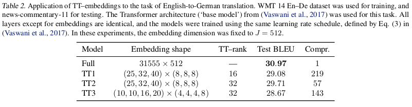

# Tensorizing Neural Networks and Transformers

Ejaaz Merali

PIQuIL

August 21st, 2020

---

## Outline

- Incorporating Tensor Trains (MPOs) into NNs
  - Tensorizing Neural Networks (Novikov et al. 2015)
  - Tensorizing Embedding Layers (Khrulkov et al. 2019)
  - Compressed Transformers (Khakhulin et al. 2019)
- Tensorizing Attention
  - TensorCoder (Zhang et al. 2020)

---

## Tensorizing Neural Networks

- Main idea is to replace the weight matrices of fully-connected layers with Tensor Trains (aka Matrix Product Operators)
- Two efficiency advantages:
  - Reduced Parameter count
  - Reduced time and space complexity

---

## Tensor Trains (1/3)

- Start with a matrix $X \in \mathbb{R}^{I\times J}$, reshape it into a tensor with $2n$ indices (i.e. a rank $2n$ tensor):

- Now have a tensor $\mathcal{X} \in \mathbb{R}^{I_1\times I_2 \times \ldots I_n \times J_1 \times J_2 \times \ldots \times J_n}$

- We can approximate this using $n$ smaller tensors of ranks 3 or 4.

---

## Tensor Trains (2/3)

- This gives us a Tensor Train:

- The edge tensors only need to be of rank 3, while the inner tensors are of rank 4.

- In Physics such a structure is often called a Matrix Product Operator.

- *Unlike* Physics, however, here we get to decide the length of the Tensor Train (more tunable hyperparameters!).
  - Also, with MPOs we often want Hermiticity; not here

---

## Tensor Trains (3/3)

Mathematically, our weight tensor is:

$$
\mathcal{X}[(i_1, j_1), (i_2, j_2), \ldots, (i_n, j_n)]
= G^{(1)}[(i_1, j_1), :] * G^{(2)}[:, (i_2, j_2), :] * \cdots
* G^{(n)}[:, (i_n, j_n)]
$$

- Applying these weights to an input vector requires reshaping the vector into a rank-$n$ tensor and performing the necessary contractions.

- This has time complexity $O(nr^2i \max(I, J))$ where $n$ is the length of the tensor train, $r$ is the maximum dimension size over all of the tensors in the train, $i = \max_k i_k$

- Compare to time complexity for a regular matrix-vector multiply: $O(IJ)$

---

## Tensorizing Neural Networks

- Idea: replace all weight matrices for fully connected layers with Tensor Trains

- Train with autodiff

- Backwards pass has time complexity $O(n^2 r^4 i \max(I,J))$, compared to $O(IJ)$

---

## Tensorizing Neural Networks: Results

Note: In this paper they compared against a matrix rank restricted layer as a baseline. This was implemented by composing two rectangular matrices such that the contracted/middle dimension was small.

---
<!--
_class: default
_footer: (Novikov et al. 2015)
-->

---

<!--
_class: default
_footer: (Novikov et al. 2015)
-->

---

<!--
_class: default
_footer: (Novikov et al. 2015)
-->

---

## Tensorizing Embeddings

- Embedding Layers are linear layers which map very large (but sparse) 1-hot vectors into smaller dense vectors

- Very large as a result

- Idea: Apply Tensor Train parametrization to Embedding Layers

- Note: since the input vector is 1-hotted, we can perform the TT-matrix-vector multiplication much more efficiently

---

## Tensorized Embeddings: Results

---

<!--
_class: default
_footer: (Khrulkov et al. 2019)
-->

---

<!--
_class: default
_footer: (Khrulkov et al. 2019)
-->

---

<!--
_class: default
_footer: (Khrulkov et al. 2019)
-->

---

## Tensorized Embeddings: Comment on tied weights

- It is often useful to tie the weights of input and output embeddings
- In the last table, they did this with the baseline architecture, but not their own

---

## Compressed Transformers

- GitHub project not a paper
- Apply Tensor Train parametrization to every FFN in a Transformer
- Results look promising, but runtime suffers (probably due to a sub-optimal implementation)
- Methodology isn't very well explained

---

## Compressed Transformers: Results

---

WMT16 Translation Task

Method | BLEU | N_comp/N | Compression Rate | Time
-------|------|----------|------------------|------
original model | 0.442 | 0/6 | 1.0 | 41.38
tt-transformer | 0.407 | 6/6 | 1.644 | 84.56
small-transformer | 0.403 | 0/3 | 1.6 | -
tt-small-transformer | 0.396 | 3/3 | 2.1713 | 34.94
tt-transformer | 0.468 | 5/6 | 1.484 | 59.833
tt-transformer | 0.455 | 4/6 | 1.353 | 60.4
tt-transformer | 0.472 | 3/6 | 1.243 | 45.28
tt-transformer | 0.450 | 2/6 | 1.150 | 43.97
tt-transformer | 0.369 | 1/6 | 1.07 | 34.63
tucker         | 0.447 | 6/6 | 1.64 | 43.83

small-transformer uses 3 encoder/decoder layers instead of 6

---

Method | BLEU | Compression Rate | Time
-------|------|------------------|----
original model | 0.442 | 1.0 | 41.38
all tt2 | 0.434 | 1.65 | 76.89
5/6 tt2 | 0.489 | 1.485 | 75.24
3/6 tt2 | 0.412 | 1.243 | 71.36
1/6 tt2 | 0.414 | 1.069 | 40.97
small-transformer | 0.403 | 1.6 | 31.28
tt4 | 0.407 | 1.64 | 84.56
1/2 tt4 | 0.472 | 1.24 | 45.28
Tucker | 0.447 | 1.64 | 43.83

---

<!--
_class: default
_footer: (Khakhulin et al. 2019)
-->

---

<!--
_class: default
_footer: Training curve for *small* batch size (Khakhulin et al. 2019)
-->

---

## Tensorizing Attention

---

## TensorCoder (1/4)

- Token-wise Attention requires us to compute $QK^T \in \mathbb{R}^{N \times N}$ (token-wise attention)
  - Time-complexity: $O(N^2 d_k)$
- Propose Dimension-wise Attention which instead computes: $Q^T K \in \mathbb{R}^{d_k \times d_k}$
  - Time-complexity: $O(N d^2_k)$
  - Note: we *do not* redefine our values matrix $V$ to be of a compatible size

---

## TensorCoder (2/4)

Define $S_{jk} = f\left(\sum_{n=1}^N Q_{nj}K_{nk}\right)$, where $f$ is some function (ex. a softmax, or a scaling)

In order to keep using the same $V \in \mathbb{R}^{N\times d_v}$ matrix as with token-wise attention, we compute the Khatri-Rao product of $S$ and $V$:

$$\chi_{ijk} = S_{jk} V_{ik} \in \mathbb{R}^{N\times d_k \times d_k} \quad \sim \quad O(N d_k^2)$$

Note that we've implicitly assumed that the dimension of the key-space $d_k$ is equal to the dimension of the value-space $d_v$. This is fine since they're often taken to be equal in practice (see even the original Transformer paper).

---

## TensorCoder (3/4)

Our construction so far works fine for encoder layers, but we need causal masking for decoder or generative layers

Define a masking matrix $M \in \mathbb{R}^{N\times N}$, $M_{ij} = \mathbb{I}(i \leq j)$ (upper-triangle is full of $1$s)

$$S_{ijk} = \sum_{n=1}^N Q_{ni} K_{nj} M_{nk} \in \mathbb{R}^{d_k \times d_k \times N} \quad \sim \quad O(N^2 d_k^2)$$

Then

$$\chi_{ijk} = S_{jki} V_{ik} \in \mathbb{R}^{N\times d_k \times d_k} \quad \sim\quad O(N d_k^2)$$

Aside: I think their implementation of $S_{ijk}$ is sub-optimal. You can code the summation for $S$ as a cumulative summation over $n$, in which case we only have linear time-scaling in $N$: $S_{ijk} = \sum_{n=1}^k Q_{ni} K_{nj} = S_{ij,k-1} + Q_{ki} K_{kj}$

---

## TensorCoder (4/4)

For both masked and unmasked dimension-wise attention, we finally need to return to the proper feature space

$$O_{ij} = \sum_{m=1}^d W_{jm} \chi_{ijm} \in \mathbb{R}^{N\times d_k} \quad \sim \quad O(N d_k^2)$$

where $W \in \mathbb{R}^{d_k\times d_k}$

Define an analogue to multi-head attention by learning $h$ different matrices $O$ (using different parameter sets), concatenating these along the feature dimension, and then applying a learned linear map ($hd_k \times d_m$) to get an output of size $N \times d_m$

---

## TensorCoder: Results

---

<!--
_class: default
_footer: (Zhang et al. 2020)
-->

---

<!--
_class: default
_footer: (Zhang et al. 2020)
-->

---

<!--
_class: default
_footer: (Zhang et al. 2020)
-->

---

## TensorCoder: Comments (1/2)

- IMO, dimension-wise attention likely loses expressivity
  - Decreased performance on the Wiki-103 dataset vs PTB might be an indicator of this
  - TensorCoder implicitly assumes that input and output sequences are the same length in order to compute $S_{ijk} = \sum_{n=1}^N Q_{ni} K_{nj} M_{nk}$ (probably not a big deal)
- Since we're assuming $d_k = d_v$, why not just compute the output of attention as: $\chi = VS \in \mathbb{R}^{N\times d_k}$?
  - At that point we're basically swapping the roles of $Q$ and $V$...

---

## TensorCoder: Comments (2/2)

- Linearization proposed by the "Transformers are RNNs" paper is still better in terms of memory usage (don't need to store a $N \times d_k \times d_k$ array)
  - Because we sum over the "time" index, we're forced to store this large array in order to enforce causal masking
- Main contribution of this paper (IMO): how to introduce more parameters into the attention calculation through $W$:

$$O_{ij} = \sum_{m=1}^{d_k} W_{jm} \chi_{ijm} \qquad \chi_{ijk} = S_{jki} V_{ik} \quad \text{or} \quad \chi_{ijk} = S_{jk} V_{ik}$$

---

## References

Novikov, Alexander, et al. "Tensorizing neural networks." Advances in neural information processing systems. 2015.

Khrulkov, Valentin, et al. "Tensorized embedding layers for efficient model compression." arXiv preprint arXiv:1901.10787 (2019).

Khakhulin, Taras, et al. "Compressed Transformer." GitHub repository https://github.com/khakhulin/compressed-transformer

Ma, Xindian, et al. "A tensorized transformer for language modeling." Advances in Neural Information Processing Systems. 2019.

Zhang, Shuai, et al. "TensorCoder: Dimension-Wise Attention via Tensor Representation for Natural Language Modeling." arXiv preprint arXiv:2008.01547 (2020).
