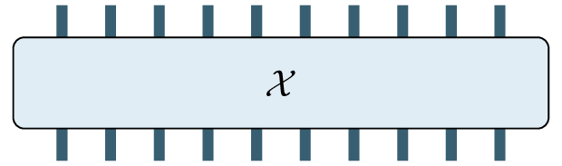

# Tensorizing NNs and Transformers

Ejaaz Merali

PIQuIL

August 14th, 2020

---

## Outline

- Incorporating Tensor Trains (MPOs) into NNs
  - Tensorizing Neural Networks (Novikov et al. 2015)
  - Tensorizing Embedding Layers (Khrulkov et al. 2019)
  - Compressed Transformers (Khakhulin et al. 2019)
- Tensorizing Attention
  - Multi-Linear Attention (Ma et al. 2019)
  - TensorCoder (Zhang et al. 2020)

---

## Tensorizing Neural Networks

- Main idea is to replace the weight matrices of fully-connected layers with Tensor Trains (aka Matrix Product Operators)
- Two efficiency advantages:
  - Reduced Parameter count
  - Reduced time and space complexity

---

## Tensor Trains (1/3)

- Start with a matrix $W \in \mathbb{R}^{I\times J}$, reshape it into a tensor with $2n$ indices (i.e. a rank $2n$ tensor):

- Now have a tensor $\mathcal{W} \in \mathbb{R}^{I_1\times I_2 \times \ldots I_n \times J_1 \times J_2 \times \ldots \times J_n}$

- We can approximate this using $n$ smaller tensors of rank (at most) 4.

---

## Tensor Trains (2/3)

- This gives us a Tensor Train:

- The edge tensors only need to be of rank 3, while the inner tensors are of rank 4.

- In Physics such a structure is often called a Matrix Product Operator.

- *Unlike* Physics, however, here we get to decide the length of the Tensor Train (more tunable hyperparameters!).

---

## Tensor Trains (3/3)

Mathematically, our weight tensor is:

$$
\mathcal{W}[(i_1, j_1), (i_2, j_2), \ldots, (i_n, j_n)]
= A^{(1)}[(i_1, j_1), :] * A^{(2)}[:, (i_2, j_2), :] * \cdots
* A^{(n)}[:, (i_n, j_n)]
$$

- Applying these weights to an input vector requires reshaping the vector into a rank-$n$ tensor and performing the necessary contractions.

- This has time complexity $O(nr^2i \max(I, J))$ where $n$ is the length of the tensor train, $r$ is the maximum dimension size over all of the tensors in the train, $i = \max_k i_k$

- Compare to time complexity for a regular matrix-vector multiply: $O(IJ)$

---

## Tensorizing Neural Networks

- Idea: replace all weight matrices for fully connected layers with Tensor Trains

- Train with autodiff

- Backwards pass has time complexity $O(n^2 r^4 i \max(I,J))$, compared to $O(IJ)$

---

## Tensorizing Neural Networks: Results

---
<!--
_class: default
_footer: (Novikov et al. 2015)
-->

---

<!--
_class: default
_footer: (Novikov et al. 2015)
-->

---

<!--
_class: default
_footer: (Novikov et al. 2015)
-->

---

## Tensorizing Embeddings

- Embedding Layers are linear layers which map very large (but sparse) 1-hot vectors into smaller dense vectors

- Very large as a result

- Apply Tensor Train parametrization to Embedding Layers

- Note: since the input vector is 1-hotted, we can perform the TT-matrix-vector multiplication much more efficiently

---

## Tensorized Embeddings: Results

---

<!--
_class: default
_footer: (Khrulkov et al. 2019)
-->

---

<!--
_class: default
_footer: (Khrulkov et al. 2019)
-->

---

<!--
_class: default
_footer: (Khrulkov et al. 2019)
-->

---

## Tensorized Embeddings: Comment on tied weights

- It is often useful to tie the weights of input and output embeddings
- In the last table, they did this with the baseline architecture, but not their own

---

## Compressed Transformers

- GitHub project not a paper
- Apply Tensor Train parametrization to every FFN in a Transformer
- Results seem good, but runtime suffers (probably due to non-optimal implementation)

---

## Compressed Transformers: Results

---